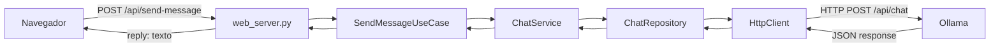
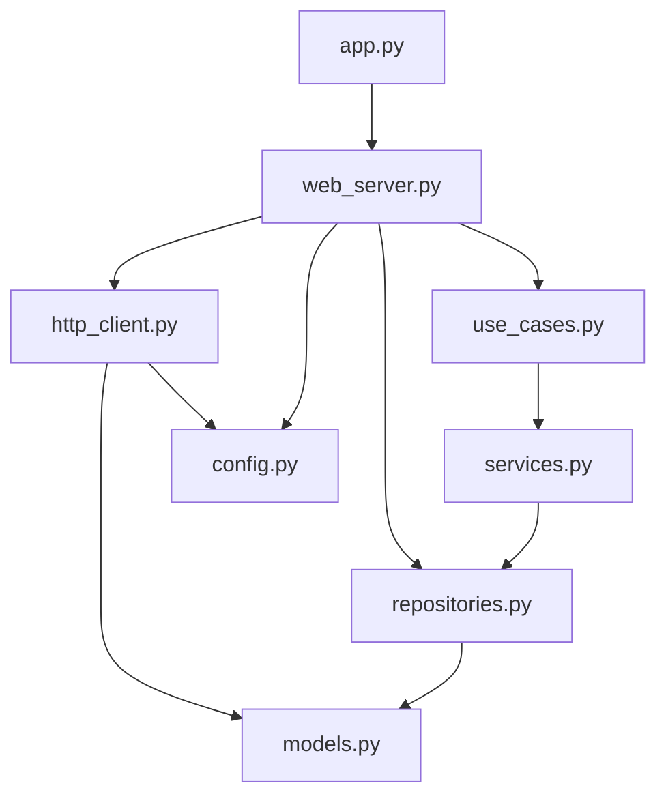

# Andes Code

Asistente de arquitectura de software senior que corre localmente en tu máquina, sin enviar código a servidores externos. Basado en `qwen2.5-coder:14b` con personalidad y reglas de arquitectura fijadas mediante un System Prompt.

**Reglas de oro que aplica automáticamente:**
- Patrones de diseño: Repository, Factory, DTOs
- Clean Architecture (Dominio → Aplicación → Infraestructura)
- Python con Type Hints, TypeScript con tipado estricto
- PostgreSQL con índices, constraints y tipos correctos
- Código documentado en español

---

## Requisitos

| Componente | Detalle |
|---|---|
| **GPU** | RTX 4070 (8 GB VRAM) o superior |
| **RAM** | 16 GB mínimo (el modelo carga ~9 GB) |
| **CPU** | i9 o equivalente (para mover pesos RAM → VRAM al inicio) |
| **OS** | Ubuntu 24.04 (o cualquier distro con soporte Ollama) |
| **Ollama** | `curl -fsSL https://ollama.com/install.sh \| sh` |
| **Modelo base** | `ollama pull qwen2.5-coder:14b` |
| **Python** | 3.10+ (solo para `chat_app`) |

---

## Instalación

### 1. Descargar el modelo base

```bash
ollama pull qwen2.5-coder:14b
```

### 2. Compilar el modelo personalizado

Desde la carpeta de este proyecto:

```bash
ollama create arquitecto-senior -f ArchitectModel
```

Esto registra el modelo `arquitecto-senior` en Ollama con temperatura baja (`0.2`) y contexto de 32k tokens.

### 3. Verificar que quedó instalado

```bash
ollama list
```

Deberías ver `arquitecto-senior` en la lista.

### 4. Configurar los alias (opcional pero recomendado)

Abre `~/.bashrc` y agrega al final:

```bash
# Andes Code — alias principal
alias andes='ollama run arquitecto-senior'

# Andes Code — pasar un archivo con una instrucción
andes-revisa() {
    cat "$1" | ollama run arquitecto-senior "$2"
}

# Andes Code — generar un archivo nuevo directamente
andes-crea() {
    echo "--- Andes Code está trabajando en $1 ---"
    ollama run arquitecto-senior "Carlos, genera SOLO el contenido del archivo $1 sin charlas previas ni bloques de markdown. Instrucción: $2" > "$1"
}
```

Recarga la configuración:

```bash
source ~/.bashrc
```

---

## Uso por terminal

### Modo interactivo (chat directo)

```bash
ollama run arquitecto-senior
# o con el alias:
andes
```

Escribe tus preguntas libremente. Para salir: `Ctrl + D` o `/exit`.

### One-liner (respuesta rápida)

```bash
andes "Diseña un esquema de tablas para un blog en PostgreSQL siguiendo la 3ra forma normal."
```

### Pasar un archivo para revisión

```bash
# Revisar si cumple SOLID
andes-revisa src/models/user.py "Revisa este modelo y dime si cumple con SOLID."

# Revisar queries de base de datos
andes-revisa api.py "Optimiza las queries de Postgres en este archivo."
```

### Refactorizar y guardar el resultado

```bash
# Guardar en un archivo nuevo
cat auth.py | andes "Refactoriza este código usando el patrón Decorator para manejo de logs." > auth_refactorizado.py

# Traducir a TypeScript
cat viejo_script.js | andes "Refactoriza a TypeScript usando interfaces y documenta en español." > nuevo_script.ts
```

### Crear un archivo desde cero

```bash
andes-crea "domain/models.py" "Crea la entidad Proyecto con Type Hints y patrón Repository."
andes-crea "database.ts" "Crea la conexión a PostgreSQL usando el patrón Singleton."
```

### Agregar contenido a un archivo existente

```bash
andes "Agrega una sección al README.md explicando cómo correr los tests con pytest." >> README.md
```

---

## Interfaz web (chat_app)

Aplicación Flask que expone Andes Code como un chat en el navegador, siguiendo **Arquitectura Hexagonal** con separación estricta en tres capas.

### Estructura

```
chat_app/
├── app.py                        # Punto de entrada — arranca Flask
├── config.py                     # Configuración centralizada (host, puerto, URL Ollama)
├── requirements.txt              # Dependencias Python
├── templates/
│   └── index.html                # UI de chat (HTML + CSS + JS vanilla)
├── domain/
│   ├── models.py                 # ChatMessage — entidad pura del dominio
│   └── repositories.py          # IChatRepository — contrato abstracto
├── application/
│   ├── services.py               # ChatService — orquesta la lógica de negocio
│   └── use_cases.py              # SendMessageUseCase — acción concreta del usuario
└── infrastructure/
    ├── http_client.py            # HttpClient — habla con la API de Ollama
    └── web_server.py             # Flask app + ChatRepository + rutas HTTP
```

### Flujo de datos



### Dependencias entre capas



### Instalación de la web app

```bash
cd chat_app
pip install -r requirements.txt
```

### Ejecutar

Asegúrate de que Ollama esté corriendo antes de iniciar Flask:

```bash
# Terminal 1 — modelo de IA
ollama serve

# Terminal 2 — servidor web
cd chat_app
python app.py
```

Abre `http://localhost:5000` en el navegador.

### API REST

| Método | Ruta | Descripción |
|---|---|---|
| `GET` | `/` | Sirve la interfaz web de chat |
| `POST` | `/api/send-message` | Envía un mensaje a Andes Code |

**Request:**
```json
POST /api/send-message
Content-Type: application/json

{ "message": "Diseña un esquema para una tienda en PostgreSQL." }
```

**Response exitosa (200):**
```json
{ "reply": "Aquí tienes el esquema..." }
```

**Response de error (400):**
```json
{ "error": "El campo \"message\" es requerido" }
```

### Ejemplo con curl

```bash
curl -X POST http://localhost:5000/api/send-message \
  -H "Content-Type: application/json" \
  -d '{"message": "Diseña un esquema de tablas para una tienda en PostgreSQL."}'
```

---

## Estructura de proyecto recomendada por Andes Code

Cuando le pidas diseñar un backend, Andes Code seguirá esta estructura de **Arquitectura Hexagonal**:

```
src/
├── domain/            # Reglas de negocio puras (Entidades)
├── application/       # Casos de uso (Lógica de la aplicación)
├── infrastructure/    # Implementaciones técnicas
│   ├── persistence/   # Repositorios (SQLAlchemy o Prisma/TypeORM)
│   └── http/          # Controladores (FastAPI o Express/NestJS)
└── main.py            # Punto de entrada y composición (DI Container)
```

---

## Monitoreo de GPU

Mientras Andes Code genera código complejo, abre una terminal dividida y ejecuta:

```bash
watch -n 0.5 nvidia-smi
```

La primera respuesta puede tardar unos segundos mientras el i9 mueve los pesos del modelo de RAM a VRAM. Una vez cargado, la velocidad de escritura (tokens/segundo) será fluida.

---

## Advertencias

1. **Markdown Wrapper:** A veces el modelo envuelve el código en bloques ` ```python ... ``` `. Si usas `>` para guardar directamente, esos caracteres quedarán en el archivo y darán error de sintaxis. La función `andes-crea` ya instruye al modelo para evitarlo.

2. **Límite de contexto:** El modelo tiene 32k tokens de contexto. Evita pasar archivos de más de ~15k líneas para que la respuesta sea ágil.

3. **Git antes de sobrescribir:** Antes de dejar que Andes Code escriba sobre un archivo existente, asegúrate de tener un `git commit` hecho. Si algo sale mal, `git checkout` es tu salvavidas.

4. **Ollama debe estar corriendo:** La web app falla con `ConnectionError` si Ollama no está activo. Verifica con `ollama list` antes de iniciar Flask.

---

## PostgreSQL: Workaround vs Best Practice

| | Enfoque | Cuándo usarlo |
|---|---|---|
| ⚡ | **Instalación directa** (`sudo apt install postgresql`) | Prototipado rápido, no importa ensuciar el sistema host |
| ✅ | **Docker Compose** | Proyectos reales — levanta y destruye la DB sin residuos en Ubuntu 24.04 |
